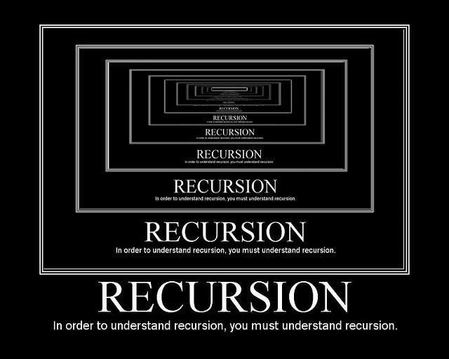

# ![[tktk Module Name] - Exercise](./assets/hero.png)

# What is recursion?

At the most simple, recursion is when a function calls itself. We know a function can call upon other functions to achieve its goal, but it can also call upon itself to achieve its goal.

When your functions start getting too big to read clearly and test easily, you split them up into smaller functions that each perform part of the larger task. A recursive function, however, will achieve a small part of the larger task, then pass the partially completed problem to another call of itself. It’s just another way of breaking down a large problem into smaller bits.



# A Useless Recursive Function

Let’s take a look at a function that calls itself and consider what it does. (Warning: running this program might cause your JS console to stall forever, or crash.)

```js
// define the function
function philosopher() {
	console.log('hmm...');
	// call itself
	philosopher();
}
// call the function initially
philosopher();
```

Why does this function come with a warning? When we call `philosopher()` initially, it prints out `"hmm..."`. Then, the function calls `philosopher()` — as in, itself. So, it will once again print `"hmm..."` before calling itself again... forever!

In practice, the function will eventually crash. Your computer will run out of memory and you’ll see an error message saying something like, “stack overflow exception” or “maximum call stack exceeded.” That’s not really what we’re looking for.

# Fixing the problem

Let’s look at another recursive function - but this one doesn’t come with a warning label (AKA, it won’t crash your computer).

```js
function countDown(num) {
	if (num < 0) {
		return;
	}
	console.log(num);
	return countDown(num - 1);
}
```

This function just counts down from a given number to zero. Notice how the last part of the function calls itself, but with a slightly different argument than the number initially given. This is what makes the function recursive and stops it from running forever, into eternity.

# Three Steps to Recursion

We can break down the process of a recursive function into three steps.

1. **Base case:** When the process can stop
2. **Action:** Put that function to work!
3. **Recursive case:** The function is called again, but with the assurance that progress is being made towards the base case

Let’s break each part down by looking at our recursive countdown function if we started with `3` as the argument.

```js
function countDown(num) {
	if (num < 0) {
		return;
	}
	console.log(num);
	return countDown(num - 1);
}

countDown(3);
```

## The Base Case

Here’s the base case for this function:

```js
function countDown(num)
  if(num < 0){
    return;
  }
```

The base case establishes when the recursive function can finally return a specific value, and no longer needs to continue calling itself to find that specific value. The base case is where the function bottoms out.

In the countdown function, we first check if the number given is less than `0`. Since `3` is not less than `0`, we can proceed. Once we get below `0`, the countdown is over and the function can complete.

## The Action

Between the base case and recursive case, the function performs an action. In our countdown function, we simply want to count each number before proceeding to the next one, so we `console log() 3`.

```js
function countDown(num) {
	if (num < 0) {
		return;
	}
	console.log(num);
}
```
You may see the action introduced by “else”, as below. This doesn’t change the function, just adds in some plain language explaining what happens in the function.

```js
function countDown(num) {
	if (num < 0) {
		return;
	} else {
		console.log(num);
	}
}
```

## The Recursive Case

Finally, we use recursion by calling the `countDown()` function again. Only this time, we feed it the next number in the sequence, by providing `num - 1` as the argument.

```js
function countDown(num) {
	if (num < 0) {
		return;
	}
	console.log(num);
	return countDown(num - 1);
}
```

In plain English, let's explain what happens when this function reaches the recurisve case. (Remember we passed in `3` as the argument)

1. Count the number ``3`, then call the `countDown` function again with `2` as the given number.
2. The function makes sure that `2` is still greater than zero. It is! Proceed.
3. Count the number `2`, and call `countDow`n again with `1`.
4. The function checks `1` against `0` (it’s greater), console logs `1`, and calls `countDown` with `0`.
5. The `countDown` confirms that `0` isn't less than `0`, counts the number `0`, and call `countDown` again with `-1` as the given number.
6. Finally, the base case occurs! The “if” check realizes we've gone past `0` and are into negative numbers, and simply returns to stop the sequence, instead of continuing on with the next few steps.

## Knowledge Check

If a recursive function calls itself twice in the recursive case, this would result in **\_** complexity.

1. Linear
2. Quadratic
3. Constant
4. Logarithmic

<details open>
<summary>Reveal the answer.
</summary>
<br>
Correct answer: 2 - Quadratic. If each recursive call generates two more recursions, this would result in quadratic growth, meaning that its complexity would scale at an N^2 rate. At the first layer, it would recurse twice. In the second layer, you would have four recursive calls. The third layer would have eight recursions, and so on.
</details>

---

# Writing Recursive functions

There are four basic steps to writing a recursive function:

1. Define your function and parameters
2. Define your base case and return the computed result
3. Perform the action step
4. Return the function, with new arguments to make progress towards the base case

Let’s work through these steps using a function that will add all the numbers in an array. Follow along in your `recursion.js` file.

## First Things First: Function and parameters

First, let’s write our function. We can use a basic sum function for this problem.

When writing recursive functions, our parameters are important. In this case, we’ll set our parameters as the array we’re in, the index we’re at, and the sum of the numbers so far:

```js
function sumArrayOfNums(arr, index, sum) {
}
```

### Even Better Parameters

With recursive functions, it can be helpful to give your parameters default values to reduce some of the function’s calls.

In our sum function example, we might set the index and sum at 0. When they’re defined this way, the index and sum don’t need to be provided when calling the function:

```js
function sumArrayOfNums(arr, index = 0, sum = 0) {
}
```

## Step Two: Define the Base Case

Now that our parameters are set, we can add the base case — when the function can stop and return the computed result.

Here, the function can return the sum when the index has gone past the end of the array:

```js
function sumArrayOfNums(arr, index = 0, sum = 0) {
	if (index === arr.length) {
		return sum;
	}
}
```

## Step Three: Action Step

Next, add the action step. Here, we’ll add the number at the current index in the array to the sum:

```js
function sumArrayOfNums(arr, index = 0, sum = 0) {
	if (index === arr.length) {
		return sum;
	}
	sum += arr[index];
}
```

## Step 4: Recursion!

Finally, return the function with new arguments to make progress toward the base case. Here, we indicate `index + 1` so that the function continues moving through the length of the array:

```js
function sumArrayOfNums(arr, index = 0, sum = 0) {
	if (index === arr.length) {
		return sum;
	}
	sum += arr[index];
	return sumArrayOfNums(arr, index + 1, sum);
}
```

> Don’t forget to return the recursive function call! Otherwise, the final return value won’t go beyond the second-to-last recursive call. Each recursive call needs to return the value of the next call, so the end result gets passed back up the chain to the very first call of the function (the base case).

In your `recursion.js`, test your function with the array `[2, 4, 5, 8]`. (We’ll do the math for you: You should get `19`.)

## Recursive Helper Functions

Sometimes, recursive functions can only get by with a little help from their friends: recursive helper functions. These come in handy when a recursive function needs to branch out in several different directions. You’ll often want a parent scope to hold onto the progress made by each recursive call.

It can be useful to include a non-recursive parent function in which you define and call a recursive function. Including a non-recursive parent function can also eliminate the need for the recursive function within it to hold onto information with parameters. This pattern is especially useful for combination problems, when each recursive function might be calling itself several times with different inputs. A parent function can hold a list of all the combinations, and each recursive call can post its end result to the list held in the parent scope.

Here’s what `sumArrayOfNums()` would look like with a helper function:

```js
function sumArrayOfNums(arr) {
	let index = 0;
	let max = arr[0];
	// notice the lack of parameters in rSum!
	function rSum() {
		if (index === arr.length) {
			return max;
		}
		if (arr[index] > max) {
			max = arr[index];
		}
		index++;
		return rSum();
	}
	// once you've defined the helper function, make sure you call it!
	return rSum();
}
```

# Why Recursion?

To answer that question, we can compare recursion to something you already know and love: loops, which use iteration.

For simple problems, a `for` loop is just as good as a recursive function. In fact, almost any recursive function can be written using iteration — for example, our `countDown()` function:

```JS
function countDown(num){
  for (x=num; x > 0; x--) {
    console.log(x);
  }
}
```

In most cases, iteration is more efficient than recursion, since it uses less memory space. So why use recursion at all?

As we tackle more complex problems, some will make more sense to solve recursively than iteratively. Recursion is written more cleanly and with less code, especially when a problem gets larger and larger.

But the bottom line is that there’s no hard and fast rule. A quick search on [Stack Overflow](https://stackoverflow.com/search?q=recursion+or+iteration) will return myriad opinions on whether recursion or loops are better. Some programmers think recursion is easier to read, while others argue that loops are easier; some people argue that loops are more concise than recursion, while others argue that recursion can be written with less code; some people see more risks in writing loops than in recursion and vice versa.

In the end, it’s up to you and your understanding of the problem you are solving.

# When to Use Recursion

Recursion operates by breaking down a problem into smaller chunks. So, if you have a problem that can be broken down in this way, recursion is a natural fit.

Use recursion in any situation that requires exploring multiple possibilities or paths, such as:

* Calculating all possible combinations of elements.
* Checking all possible routes between two destinations.

Recursion provides the simplest solution to problems like these by allowing a function to continue through each possibility in a new recursive call.

# Knowledge Check

Which of these scenarios is best suited for a recursive function?

1. Searching an unsorted list of users for a specific username.
2. Determining all possible words that can be formed from a given set of letters.
3. When there's a limited amount of space in memory and we need the most efficient solution.

<details open>
<summary>Reveal the answer.
</summary>
<br>
Correct answer: 2. Recursion is a great solution to problems that need to explore every option - all possibilities, combinations, etc.
</details>

---

# Let's Talk About interviews

Given how frequently it can be used to write algorithms and functions, recursion is a common interview topic. Here’s what you might encounter:

* Determining if a given problem is a good fit for a recursive solution and why.
* Writing a recursive function. Even if you’re not asked to code the solution, you might be asked to sketch or explain how the function would be written. Here’s what that might look like.

Check out these articles for more examples of how recursion may come up in engineering interviews:

- [Hacker Noon](https://hackernoon.com/coding-interview-recursion-f0d60c9dbb60)
- [Interviewing.io](https://interviewing.io/recursion-interview-questions)


# Additional Resources.

- Sketching out a [recursive function](https://www.youtube.com/watch?v=bGC2fNALbNU).
- Just for fun: The [recursion subreddit](https://www.reddit.com/r/recursion).
